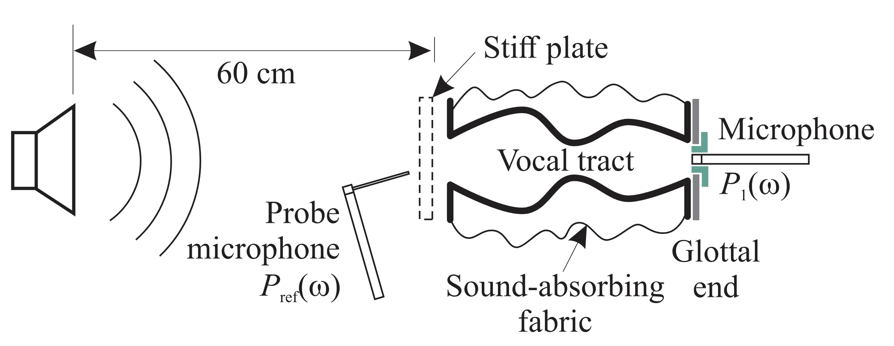
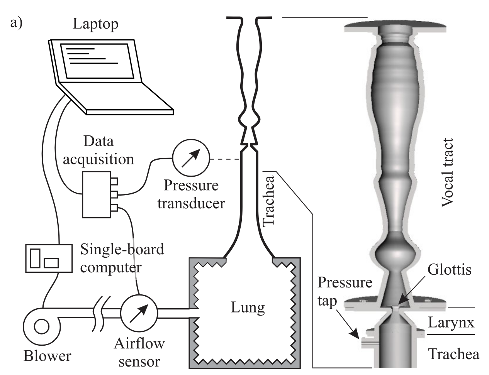

## General hypotheses

In this manuscript, all the models considered share the general __hypotheses__:

- (H1): Before reduction to 1D, viscous effects are neglected resulting in a fully conservative fluid flow. As they influence the behavior of the fluid through dissipations, thermal effects are not taken into account and a homentropic (constant entropy in space and time) flow is considered.
- (H2): Small density variations around the rest state are assumed, resulting in the use of a linearized equation of state relating pressure $P$ and density $\rho$, given by 
$$
\begin{equation}
    P = P_0 + \frac{\partial P}{\partial \rho} \bigg|_{\rho = \rho_0} (\rho - \rho_0) = P_0 + c_0^2 (\rho - \rho_0)
\end{equation}
$$
where $P_0$ is the pressure at rest state, $\rho_0$ the density at rest state and $c_0$ the speed of sound. This assumption will be used to derive a closed form of the internal energy function $u(\rho)$. 
- (H3): The flow is supposed irrotational. This assumption is strong, as it is known that it is not valid everywhere in the larynx (or near exciters in wind instruments). However, it is a convenient hypothesis for the reduction to a quasi-1D model. Some effects related to the formation of rotational structures downstream of the glottis are however represented as lumped dissipation laws introduced in the discrete models.

The __spatial domain__ of interest for representing the fluid in the vocal apparatus, or wind instruments is a tube with open ends and moving walls. In Cartesian coordinates, the domain is defined as
$$
\begin{equation}
  \Omega(t) = \{\xi = (x, y, z) | x \in (0, l_0), (y, z) \in S(x, t) \},
  \label{eq:domain}
\end{equation}
$$
with $S(x, t)$ the cross-section of the tube at position $x$ and time $t$, of area $A(x, t)$ and boundary $\partial S(x, t)$. The shape of the cross-section is not yet specified but supposed to be a connected space. The boundary of the domain is separated into two parts:

- Fluid-fluid boundaries, denoted $\partial\Omega_f = \{\xi = (x, y, z) \in \Omega(t) | x = \{0, l_0\}  \}$, corresponding to interfaces through which the fluid can flow. The boundaries are considered fixed in time.
- Fluid-structure boundaries, denoted $\partial\Omega_s = \partial\Omega \backslash \partial\Omega_f$, corresponding to interfaces with tissues or mechanical parts. These boundaries are assumed to be impervious, meaning that the normal velocity of the fluid $\mathbf v . \mathbf n$ is equal to the normal velocity of the structure $\mathbf w . \mathbf n$:
$$
\begin{equation}
  \mathbf v . \mathbf n \vert_{\partial \Omega_s} = \mathbf w . \mathbf n \vert_{\partial \Omega_s},
  \label{eq:bcwalls}
\end{equation}
$$
where $\mathbf v$ denotes the fluid velocity, $\mathbf n$ the normal vector to $\partial\Omega_s$ and $\mathbf w$ the structure velocity.

This choice appropriately represents the vocal apparatus from lungs to lips with a few exceptions coming from the hypothesis that $S(x, t)$ is a connected space. Indeed, at the exit of the larynx, the epiglottis separates the cross-section in two disconnected spaces. Also, the nasal tract is separated from the mouth and may play an important role on the vocal tract resonant frequencies. On this last point however, note that it is possible to build several domains compatible with \eqref{eq:domain} and connect them together using compatibility conditions at the interfaces.

### Specific density

The expression of the __specific energy__ (i.e. per-unit mass density of internal energy) of the fluid $u(\rho)$ is derived using Gibbs equation and hypothesis (H1) and (H2). The specific enthalpy $\mathfrak h = u(\rho) + \frac{P}{\rho}$ is also introduced. The Gibbs equation in its mass specific form writes
$$
\begin{equation}
  (a): d u = T\; {\rm d} s - P\; {\rm d}\frac{1}{\rho} 
  \overset{(H1)}{=} - P\; {\rm d}\frac{1}{\rho} = \frac{P}{\rho^2} d\rho \quad \Leftrightarrow \quad  (b): \frac{1}{\rho} {\rm d} P = {\rm d} \mathfrak{h}
  \label{eq:gibbs}
\end{equation}
$$
Integrating (a) from $u_0 = u(\rho_0)$ yields
$$
\begin{align}
  u(\rho) - u_0 &=  \int_{\rho_0}^\rho \frac{d u}{d \rho} d\rho,\nonumber\\\
  &= \int_{\rho_0}^\rho \frac{P (\rho)}{\rho^2} d\rho, \nonumber\\\
  &\overset{(H2)}{=} \int_{\rho_0}^\rho \frac{P_0 + c_0^2 (\rho - \rho_0)}{\rho^2} d\rho, \nonumber\\\
  &= (P_0 - c_0^2 \rho_0) \left(\frac{1}{\rho_0} - \frac{1}{\rho}\right) + c_0^2 \ln\left(\frac{\rho}{\rho_0}\right),
  \label{eq:internal_energy}
\end{align}
$$
for the expression of the internal energy. The enthalpy is then given by:
$$
\begin{equation}
  \mathfrak{h}(\rho) = \frac{\partial (\rho u(\rho))}{\partial \rho} = \mathfrak{h}_0 + c_0^2 \ln\left(\frac{\rho}{\rho_0}\right), \text{ with } \mathfrak{h}_0 = \frac{P_0}{\rho_0} + u_0.
  \label{eq:enthalpy}
\end{equation}
$$

### Quadratic expansion of the potential energy

Under the above hypotheses, the potential energy volume density writes 

$$
  \begin{equation*}
    E_p = \rho u(\rho),
  \end{equation*}
$$

and is not quadratic. Performing a second order expansion around $\rho = \rho_0$ yields the following quadratic formulation:

$$
  \begin{equation*}
    E_p = \tilde \rho \left(\frac{P_0}{\rho_0} + u_0 \right) + \rho_0 u_0 +\frac{1}{2} c_0^2 \left( \frac{\tilde \rho^2}{\rho_0}\right),
  \end{equation*}
$$

where $\tilde \rho$ denote small variations around $\rho_0$. Setting $u_0 = \frac{P_0}{\rho_0}$ and discarding the constant offset $\rho_O u_0$ results in the classical expression for wave propagation

$$
  \begin{equation}
    E_p =\frac{1}{2} c_0^2 \left( \frac{\tilde \rho^2}{\rho_0}\right),
    \label{eq:quadratic_pot}
  \end{equation}
$$

## Euler equations for 3D flows

Consider the following set of PDE to describe the motion of a compressible inviscid fluid in the domain $\Omega \subset \mathbb R^3$ (Euler equations), where $\frac{\rm d}{\rm dt}:= \partial_t + \mathbf v. {\rm grad}$ denotes the material derivative:

$$
\begin{align}
    &\frac{\rm d}{\rm dt} \rho = - \rho\; {\rm div}(\mathbf{v}) &&\Leftrightarrow  \partial_t \rho + {\rm div}(\underset{\mathbf q}{\underbrace{\rho \mathbf{v}}}) = 0, \label{eq:mass}\\
    &\frac{\rm d}{\rm dt} \mathbf{v} = -\frac{1}{\rho} 
       {\rm grad}(P)
     &&\overset{(H4)}{\Leftrightarrow} \partial_t \mathbf v +\underset{{\rm grad} (\mathfrak h_{tot})}{\underbrace{{\rm grad}\left(\frac{1}{2} \mathbf v^2\right) + \frac{1}{\rho} {\rm grad}(P)}} = 0.\label{eq:velocity}
\end{align}
$$

Choosing state $\alpha = [\rho, \mathbf{v}]^\intercal$, the Hamiltonian counting the total energy inside $\Omega(t)$ is given by
$$
\begin{equation}
    \mathcal H (\alpha, \Omega(t)) = \int_{\Omega(t)} \left( \frac{1}{2}  \mathbf{v}^2 + u(\rho) \right) \rho\; d\Omega,
\end{equation}
$$
from which the effort is derived using variational derivatives

$$
\begin{equation*}
  \mathbf e = \begin{bmatrix}
    \delta_\rho\mathcal H (\alpha) = \mathfrak{h} + \frac{1}{2} \mathbf v^2 =: \mathfrak{h}_{tot} \\
    \delta_{\mathbf v}\mathcal H (\alpha)= \rho \mathbf v =: \mathbf q
  \end{bmatrix},
\end{equation*}
$$

and includes the total enthalpy $\mathfrak{h}_{tot} = \mathfrak{h} + \frac{1}{2} \mathbf{v}^2$ and mass flow rate $\mathbf q = \rho \mathbf v$.
Rewriting the equations of conservation in a matrix form yields the following pseudo-pH (as the dynamics of the domain $\Omega(t)$ are not included) formulation

$$
\begin{align}
  \partial_t
  \begin{bmatrix}
    \rho \\
    \mathbf{v}
  \end{bmatrix}
  =
  \underset{S}{\underbrace{
  \begin{bmatrix}
    0 & -{\rm div} \\
    -{\rm grad} & 0
  \end{bmatrix}}}
  \begin{bmatrix}
    \delta_\rho\mathcal H (\alpha) = \mathfrak{h}_{tot} \\
    \delta_{\mathbf v}\mathcal H (\alpha) = \mathbf q
  \end{bmatrix}
  .
  \label{eq:pH_compressible}
\end{align}
$$

In order to show that the operator $S$ is a formally skew-adjoint operator (as expected for conservative systems), the power balance is computed using the Leibniz integral rule for differentiation of integral with moving domains, and the divergence theorem
$$
\begin{align}
  \frac{\rm d}{\rm dt} \mathcal H (\alpha, \Omega(t)) &= \int_\Omega - {\rm div}(\mathbf q\; \mathfrak h_{tot})\; {\rm d} \Omega + \int_{\partial \Omega} \left( \frac{1}{2}  \mathbf{v}^2 + u(\rho) \right)\rho  \mathbf w. \mathbf n \; {\rm d}\gamma,\\\
  &= - \int_{\partial \Omega_f} \mathbf q. \mathbf n \; \mathfrak h_{tot} \; {\rm d}\gamma- 
  \int_{\partial \Omega_s} \mathbf v. \mathbf n \; P \; {\rm d}\gamma. \label{eq:pbaltD}
\end{align}
$$
On the open boundary $\partial \Omega_f$, the power exchanged with the surrounding fluid therefore writes as the product of the trace of the efforts at the boundaries (mass flow times total enthalpy). On the closed boundaries, this is not directly the case as the geometry variation is not yet represented in the state. It is however useful to clearly identify this contribution as the product of the volume flow and pressure to later compare it with its equivalent after reduction to a 1D system and spatial discretization.

## 3D to 1D reduction

### Keeping all nonlinearities

A set of one dimensional equations, derived from \eqref{eq:pH_compressible}, is obtained by integrating over the cross-section $S(x, t)$ of area $A(x, t)$. The following additional assumptions are considered:

- (H2.1): The contribution of the transverse velocity components $v_y$ and $v_z$ to the kinetic energy $\frac{1}{2}\ \rho \mathbf{v}^2$ is negligible, i.e. $\frac{1}{2}\ \rho \mathbf{v}^2 \approx \frac{1}{2}\ \rho v_x^2$.
- (H2.2): $v_x$ and $\rho$ are independent of the transverse coordinates ($y$ and $z$). This assumption corresponds to a plane wave model in acoustics, and is valid in the vocal tract for frequencies below $5000$ Hz (see e.g. [Chapter 4] of Flanagan 2013[@flanagan2013speech]).

__Mass equation:__ using linear mass density $\mu = \rho A$ and axial mass flow $q_x = A\rho v_x$, integration of \eqref{eq:mass} over $S(x, t)$ yields, using \eqref{eq:bcwalls}:

$$
\begin{equation*}
    \partial_t \mu + \partial_x q_x = 0.
\end{equation*}
$$

__Axial momentum equation:__ integration of \eqref{eq:velocity} and use of (H2.1) and (H2.2) yields

$$
\begin{equation*}
    \partial_t v_x+ \partial_x\mathfrak{h}_{tot} = 0.
\end{equation*}
$$

The state vector is defined as 
$$
  \alpha = \begin{bmatrix}
    v_x, &
    \mu, &
    A
  \end{bmatrix}^\intercal.
$$
It includes the geometry configuration through variable $A$. The Hamiltonian may then be written using only the state as

$$
\begin{equation}
  \mathcal H(\alpha) = \int_{0}^{l_0} \left( \frac{1}{2} \mu v_x^2 + \mu u\left(\frac{\mu}{A}\right)\right) dx.
  \label{eq:Ham_fluid_1D}
\end{equation}
$$

The dynamical equations write as a pHs with a distributed input $u_{dis}$ accounting for the rate of area variation $\partial_t A$

$$
\begin{align}
  \begin{bmatrix}
    \partial_t v_x \\
    \partial_t \mu \\
    \partial_t A \\
    y_{dis} = P
  \end{bmatrix}
  =
  \left[\begin{array}{ccc|c}
    0 & -\partial_x & 0 & 0\\[.5ex]
    -\partial_x & 0 &0 & 0\\[.5ex]
    0 & 0 & 0 & 1\\[.5ex]\hline
    0 & 0 & -1 & 0
\end{array}\right]
  \begin{bmatrix}
    \delta_{v_x}\mathcal H(\alpha) = \mu v_x =: q_x \\
    \delta_{\mu}\mathcal H(\alpha) = \frac{1}{2} v_x^2 + u + \frac{P}{\rho} =: \mathfrak{h}_{tot} \\
    \delta_A\mathcal H(\alpha) = -P \\
    u_{dis} = \partial_t A
  \end{bmatrix}.
  \label{eq:pH_1D}
\end{align}
$$

The power balance writes
$$
\begin{align}
  \frac{d}{dt} \mathcal H(\alpha) &= - \left[q_x \mathfrak h_{tot}\right]^{l_0}_{0}  - \int_0^{l_0} P \partial_t A \; dx,
  \label{eq:pow_bal_euler1D}
\end{align}
$$
which is the direct equivalent of \eqref{eq:pbaltD} in the 1D case, as $\int_{\partial S} \mathbf v . \mathbf n \; {\rm d} \gamma = \partial_t A$.
If the distributed input term is zero, then the system reduces to a (nonlinear) horn equation. 

### Using the second-order expansion of the potential energy

Considering the quadratic potential energy \eqref{eq:quadratic_pot}, the system can be reduced further. In this case, and in order to have a meaningful rest state, a change of state is performed to the new state:

$$
\alpha = \begin{bmatrix}
  v_x, &
  \tilde \rho, & A\end{bmatrix}^\intercal ,
$$ 

with corresponding Hamiltonian

$$
\begin{equation*}
  \mathcal H(\alpha) = \int_{0}^{l_0} \frac{1}{2} A  \left(  (\rho_0 + \tilde \rho) v_x^2 + c_0^2 \frac{\tilde \rho^2}{\rho_0}\right) dx,
\end{equation*}
$$

and equations of motion

$$
  \begin{align}
    \begin{bmatrix}
      \partial_t v_x \\
      \partial_t \rho \\
      \partial_t A \\
      y_{dis} = P
    \end{bmatrix}
    =
    \left[\begin{array}{ccc|c}
      0 & -\partial_x\left(\frac{\bullet}{A}\right) & 0 & 0\\[.5ex]
      -\frac{1}{A}\partial_x & 0 &0 & -\frac{\rho_0 + \tilde \rho}{A}\\[.5ex]
      0 & 0 & 0 & 1\\[.5ex]\hline
      0 & \frac{\rho_0 + \tilde \rho}{A} & -1 & 0
  \end{array}\right]
    \begin{bmatrix}
      \delta_{v_x}\mathcal H(\alpha) = (\rho_0 + \tilde \rho )A v_x =: q_x \\
      \delta_{\tilde \rho}\mathcal H(\alpha) = A\left(\frac{1}{2} v_x^2 + \frac{c_0^2}{\rho_0} \tilde \rho\right) =: A \mathfrak{h}_{tot} \\
      \delta_A\mathcal H(\alpha) = \frac{1}{2} \left(  (\rho_0 + \tilde \rho) v_x^2 + c_0^2 \frac{\tilde \rho^2}{\rho_0}\right) \\
      u_{dis} = \partial_t A
  \label{eq:quadratic_pot_euler}
    \end{bmatrix}.
  \end{align}
$$

### With quadratic kinetic energy

The dynamics can be further linearized by considering the quadratic expansion of the kinetic energy, yielding the Hamiltonian

$$
\begin{equation*}
  \mathcal H(\alpha) = \int_{0}^{l_0} \frac{1}{2} A  \left(\rho_0 v_x^2 + c_0^2 \frac{\tilde \rho^2}{\rho_0}\right) dx,
\end{equation*}
$$

and equations of motion

$$
  \begin{align*}
    \begin{bmatrix}
      \partial_t v_x \\
      \partial_t \rho \\
      \partial_t A \\
      y_{dis} = P
    \end{bmatrix}
    =
    \left[\begin{array}{ccc|c}
      0 & -\partial_x\left(\frac{\bullet}{A}\right) & 0 & 0\\[.5ex]
      -\frac{1}{A}\partial_x & 0 &0 & -\frac{\rho_0}{A}\\[.5ex]
      0 & 0 & 0 & 1\\[.5ex]\hline
      0 & \frac{\rho_0}{A} & -1 & 0
  \end{array}\right]
    \begin{bmatrix}
      \delta_{v_x}\mathcal H(\alpha) = \rho_0 A v_x =: q_x \\
      \delta_{\tilde \rho}\mathcal H(\alpha) = A \frac{c_0^2}{\rho_0} \tilde \rho =: A  \frac{\tilde P}{\rho_0}\\
      \delta_A\mathcal H(\alpha) = \frac{1}{2} \left(  \rho_0 v_x^2 + c_0^2 \frac{\tilde \rho^2}{\rho_0}\right) \\
      u_{dis} = \partial_t A
    \end{bmatrix}.
  \end{align*}
$$

### With decomposition of small and big area variations

After this first step, \Rth{note that} the Hamiltonian of the one dimensional model is not quadratic in the state variables, as $A$ is included in the state. Two mechanisms are responsible for area variations in the vocal tract:

- (i): Articulation of vowels and consonants, which may be of great amplitude, but usually known as they result from a provided input to the system.
- (ii): Vibrations of the surrounding soft tissues, which are assumed to be small but are unknown a priori, as they result from coupling with a tissue model. 

In order to ease the design of efficient stable numerical scheme, an additional step is useful to separate these two contributions. The cross-section area is written as the sum of an externally controlled area $A_0$ (for addressing (i)) and a small perturbation $\tilde A$ (for addressing (ii)):

$$
\begin{equation}
  A(x, t) = A_0(x, t) + \tilde A(x, t).
  \label{eq:area_var}
\end{equation} 
$$

In the following, $A_0$ is included in the state vector \Rth{(and controlled by an input devoted to articulation)}, whereas $\tilde A$ is considered as a port variable only (to be connected to the soft tissue model). The Hamiltonian is modified into

$$
\begin{equation}
  \mathcal H(\alpha) = \int_{0}^{l_0} \frac{1}{2} A_0  \left(\rho_0 v_x^2 + c_0^2 \frac{\tilde \rho^2}{\rho_0}\right) dx,
\end{equation}
$$

The mass conservation equation is modified accordingly, yielding the pHs

$$
\begin{equation}
  \partial_t
  \begin{bmatrix}
    v_x \\
    \tilde{\rho} \\
    A_0 \\
    y_{dis} = P_{mod}\\
    y_{dis2} = P_{mod2}
  \end{bmatrix}
  =  
  \left[\begin{array}{ccc|cc}
    0 & -\partial_x\left(\frac{\bullet}{A_0}\right) & 0 & 0 &0\\[.5ex]
    -\frac{1}{A_0}\partial_x & 0 &0 & -\frac{\rho_0}{A_0} & -\frac{\rho_0}{A_0}\\[.5ex]
    0 & 0 & 0 & 1 & 0\\[.5ex]\hline
    0 & \frac{\rho_0}{A_0} & -1 & 0 & 0\\[.5ex]
    0 & \frac{\rho_0}{A_0} & 0 & 0 & 0
  \end{array}\right]
  \begin{bmatrix}
    \delta_{v_x}\mathcal H(\alpha) = \rho_0 A_0 v_x =: q_x \\
    \delta_{\tilde \rho}\mathcal H(\alpha) = A \frac{c_0^2}{\rho_0} \tilde \rho =: A  \frac{\tilde P}{\rho_0} \\
    \delta_{A_0}\mathcal H(\alpha) = \frac{1}{2} \left(  \rho_0 v_x^2 + c_0^2 \frac{\tilde \rho^2}{\rho_0}\right) \\
    u_{dis} = \partial_t A_0 \\
    u_{dis2} = \partial_t \tilde A
  \end{bmatrix},
  \label{eq:pH_1D_linA}
\end{equation}
$$

When connected to a linear soft tissue model representing the dynamics of $\tilde A$, efficient and stable integration schemes are available. Indeed, considering $A_0$ as a known signal (forced by the control port $u_{dis} = \partial_t A_0$), we can benefit from the linearity of \eqref{eq:pH_1D_linA} with respect to the other state variables in the design of a power-balanced numerical scheme.

### Adding visous dissipations

Several mechanisms may be responsible for dissipations in the flow. This section follows Birkholz and Hasner 2026[@birkholz2026viscous], tailored for the vocal tract. 
In the paper, the author propose models for each of these losses and optimize the parameters with respect to measurements on two different experimental setups described in the following figures (reproduced form the paper):

for acoustic measurments, and

for aerodynamic measurements.

Equations are given in a pressure drop form:

$$
    \frac{\partial P}{\partial x} = R' Q,
$$

where $R'= {\rm max}(R'_{\rm ac}, R'_{\rm flow})$ is a per-unit-length resistance. Losses are separated into two main components: 

- A viscous boundary layer loss for acoustic wave propagation $R'_{\rm ac} = R_{\rm ac} \left(\frac{A_{\rm ref}}{A}\right)^\alpha \sqrt{f_{\rm ac}}$,
- A visous resistance to steady airflow $R'_{\rm flow} = R_{\rm flow} \left(\frac{A_{\rm ref}}{A}\right)^\beta$,

for which the reference area is set to $A_{ref} = 1{\rm cm}^2$. $R_{\rm ac}$, $R_{\rm flow}$, $\alpha$ and $\beta$ are optimized parameters. Note that the point-wise maximum bewtween the two losses is taken instead of the sum, as the sum overstimates losses for small channels.

Adapting these dissipations law to the previous system is done directly by including an symmetric dissipation matrix to the velocity equation:

$$
\begin{equation}
  \partial_t
  \begin{bmatrix}
    v_x \\
    \tilde{\rho} \\
    A_0 \\
    y_{dis} = P_{mod}\\
    y_{dis2} = P_{mod2}
  \end{bmatrix}
  =  
  \left[\begin{array}{ccc|cc}
    -\frac{R'(A_0)}{\rho_0^2} & -\partial_x\left(\frac{\bullet}{A_0}\right) & 0 & 0 &0\\[.5ex]
    -\frac{1}{A_0}\partial_x & 0 &0 & -\frac{\rho_0}{A_0} & -\frac{\rho_0}{A_0}\\[.5ex]
    0 & 0 & 0 & 1 & 0\\[.5ex]\hline
    0 & \frac{\rho_0}{A_0} & -1 & 0 & 0\\[.5ex]
    0 & \frac{\rho_0}{A_0} & 0 & 0 & 0
  \end{array}\right]
  \begin{bmatrix}
    \delta_{v_x}\mathcal H(\alpha) = \rho_0 A_0 v_x =: q_x \\
    \delta_{\tilde \rho}\mathcal H(\alpha) = A \frac{c_0^2}{\rho_0} \tilde \rho =: A  \frac{\tilde P}{\rho_0} \\
    \delta_{A_0}\mathcal H(\alpha) = \frac{1}{2} \left(  \rho_0 v_x^2 + c_0^2 \frac{\tilde \rho^2}{\rho_0}\right) \\
    u_{dis} = \partial_t A_0 \\
    u_{dis2} = \partial_t \tilde A
  \end{bmatrix},
  \label{eq:pH_1D_dissip}
\end{equation}
$$

Kinetic energy losses

A thrid type of loss is included in the paper, namely kinetic energy losses at sudden expansions of the channel. However, this loss is represented in a non-passive way in the paper. More to be said on that later.

<!-- ### Nonlinear propagation in the quasi-steady, incompressible case

In the incompressible quasi-steady case, equation \eqref{eq:quadratic_pot_euler} reduces to a Bernoulli equation. Indeed, setting $\partial_t \rho = 0$ and $\partial_t v_x = 0$ gives

$$
\begin{equation*}
  \partial_x q_x = 0, \quad \partial_x \left(\frac{1}{2} v_x^2 + \frac{P}{\rho_0}\right) = 0.
\end{equation*}
$$

The state is reduced to $\alpha = [A]$ and the Hamiltonian is identically zero: $\mathcal H(A) = 0$.

$$
\begin{equation*}
  \begin{bmatrix}
    \partial_t A \\
    y_{dis} = P \\
    y_1 = \frac{P_{tot, L}}{\rho_0} \\
    y_2 = -q_{x, R} \\
  \end{bmatrix}
  =
  \begin{bmatrix}
    0 & 1 & 0 & 0 \\
    -1 & 0 & -\frac{1}{2}\frac{q_{x, L}}{\rho_0A^2} & \rho_0 \\
    0 & \frac{1}{2}\frac{q_{x, L}}{\rho_0A^2} & 0 & 1 \\
    0 & -\rho_0 & -1 & 0 
  \end{bmatrix}
  \begin{bmatrix}
    0 \\
    u_{dis} = \partial_t A \\
    u_1 = q_{x, L} \\
    u_2 = \frac{P_{tot, R}}{\rho_0}
  \end{bmatrix}
\end{equation*}
$$ -->